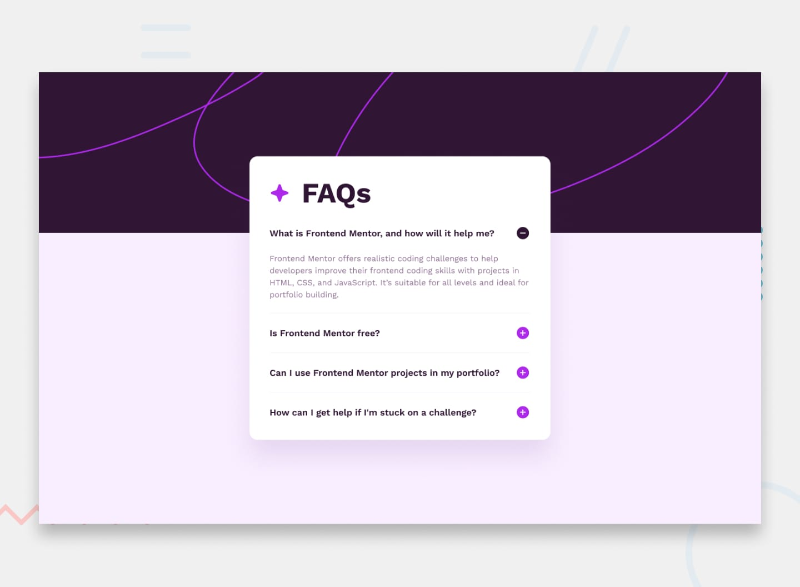

# Frontend Mentor - FAQ Accordion Solution

This is a solution to the [FAQ accordion challenge on Frontend Mentor](https://www.frontendmentor.io/challenges/faq-accordion-wyfFdeBwBz). Frontend Mentor challenges help you improve your coding skills by building realistic projects.

## Table of contents
- [Overview](#overview)
  - [The challenge](#the-challenge)
  - [Screenshot](#screenshot)
  - [Links](#links)
- [My process](#my-process)
  - [Built with](#built-with)
  - [Useful resources](#useful-resources)
- [Author](#author)

## Overview

### The challenge

Users should be able to:

- Hide/Show the answer to a question when the question is clicked
- Navigate the questions and hide/show answers using keyboard navigation alone
- View the optimal layout for the interface depending on their device's screen size
- See hover and focus states for all interactive elements on the page

### Screenshot

### Links

- Solution URL: [FAQ Accordion | Frontend Mentor](https://www.frontendmentor.io/solutions/faq-accordion-with-react-QUbXQQcYbr)
- Live Site URL: [https://faq-accordion-pperdana.netlify.app](https://faq-accordion-pperdana.netlify.app/)

## My process

### Built with

- React
- Tailwind
- Semantic HTML5 markup
- CSS custom properties
- Flexbox
- Mobile-first workflow

### Useful resources

- [A Complete Guide to Flexbox | CSS Tricks](https://css-tricks.com/snippets/css/a-guide-to-flexbox)
- [Get started with Tailwind CSS](https://tailwindcss.com/docs/installation)
- [React Reference Overview](https://react.dev/reference/react)
- [React Icons](https://react-icons.github.io/react-icons)

## Author

- Frontend Mentor - [@Panji200](https://www.frontendmentor.io/profile/Panji200)
- Website - [pperdana.netlify.app](https://pperdana.netlify.app)
